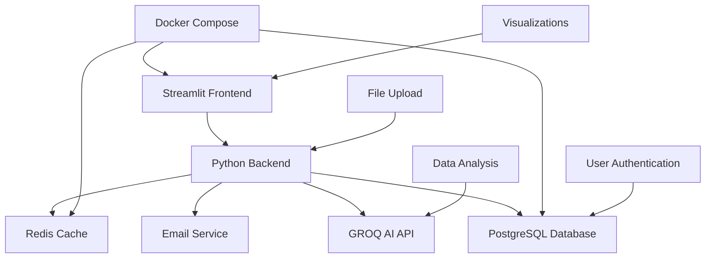

# 🤖 AI-Powered Data Assistant

[](https://python.org)
[](https://streamlit.io)
[](https://docker.com)
[](LICENSE)

A professional-grade data analysis platform powered by AI that transforms complex data analysis into simple, actionable insights. Upload your datasets and interact with your data using natural language queries, automated reports, and intelligent visualizations.

## ✨ Features

### 🔍 **AI-Powered Analysis**
- **Natural Language Queries**: Ask questions like "Show me the top 5 products by sales"
- **Intelligent Pattern Recognition**: Automated insights and trend detection
- **Smart Suggestions**: Context-aware analysis recommendations
- **Code Generation**: Automatic Python code for complex analysis

### 📊 **Advanced Analytics**
- **Statistical Analysis**: Comprehensive summaries, correlations, hypothesis testing
- **Data Quality Assessment**: Missing value analysis, outlier detection, data profiling
- **Automated EDA**: One-click exploratory data analysis with professional reports
- **Interactive Visualizations**: Charts, heatmaps, trend analysis, and custom dashboards

### 🛡️ **Enterprise-Grade Security**
- **Multi-user Authentication**: Role-based access control
- **Database Integration**: PostgreSQL with encrypted password storage
- **Session Management**: Secure login sessions with Redis caching
- **Local Processing**: Your data never leaves your environment

### 🚀 **Production-Ready**
- **Docker Deployment**: Complete containerization for easy deployment
- **Scalable Architecture**: PostgreSQL + Redis + Streamlit
- **Email Integration**: Password reset and user verification
- **Professional UI**: Beautiful, responsive design with custom styling

## 📦 Quick Start

### Option 1: Docker Compose (Recommended)

```bash
# Clone the repository
git clone git@github.com:richardtekere09/AI-Powered-Data-Assistant-with-Streamlit-Agent-Automation.git
cd AI-Powered-Data-Assistant-with-Streamlit-Agent-Automation

# Set up environment
cp .env.template .env
# Edit .env with your GROQ API key

# Start the application
docker-compose up -d

# Access the app
open http://localhost:8501
```

### Option 2: Development Setup

```bash
# Clone and setup
git clone git@github.com:richardtekere09/AI-Powered-Data-Assistant-with-Streamlit-Agent-Automation.git
cd AI-Powered-Data-Assistant-with-Streamlit-Agent-Automation

# Create virtual environment
python -m venv .venv
source .venv/bin/activate  # On Windows: .venv\Scripts\activate

# Install dependencies
pip install -r requirements.txt

# Set up database (requires PostgreSQL)
python setup.py

# Run the application
streamlit run app.py
```

## 🔧 Configuration

### Required API Keys

1. **GROQ API Key** (Required)
   - Get free key from [console.groq.com](https://console.groq.com/)
   - Add to `.env` file: `GROQ_API_KEY=your_key_here`

2. **Email Configuration** (Optional - for password reset)
   ```bash
   SMTP_USERNAME=your_email@gmail.com
   SMTP_PASSWORD=your_gmail_app_password
   FROM_EMAIL=your_email@gmail.com
   ```

### Environment Variables

```bash
# AI Configuration
GROQ_API_KEY=your_groq_api_key_here

# Database
DB_HOST=postgres
DB_PORT=your_post_number
DB_NAME=ai_data_assistant
DB_USER=user_name
DB_PASSWORD=your_password

# Application
BASE_URL=http://localhost:8501
LOG_LEVEL=INFO
DEBUG=false
```

## 👤 Authentication

### Default Test Accounts

| Username | Password | Role | Access Level |
|----------|----------|------|--------------|
| `admin` | `admin123` | Administrator | Full system access |
| `testuser` | `test123` | Standard User | Basic analysis capabilities |

### ⚠️ Security Notice

**Default accounts are for development/testing only:**
- Change all default passwords before production use
- Create new admin accounts with strong passwords
- Delete or disable test accounts in production
- Enable email verification for new user registration

## 📈 Usage Examples

### Basic Data Analysis

```python
# Upload your CSV/Excel file via the sidebar
# Then ask natural language questions:

"Show me the first 10 rows of this dataset"
"Create a histogram of the sales column"
"What are the missing values in my data?"
"Find correlations between all numeric columns"
"Generate a comprehensive statistical summary"
```

### Advanced Analytics

```python
# Complex analysis queries:
"Compare revenue trends by quarter and region"
"Identify outliers in customer transaction amounts"
"Create a correlation matrix with significance testing"
"Analyze seasonal patterns in the time series data"
"Generate predictive insights for next quarter"
```

### Automated Reports

- **EDA Reports**: One-click comprehensive data analysis
- **Statistical Summaries**: Automated insights and recommendations
- **Data Quality Reports**: Missing values, outliers, data types analysis
- **Export Options**: Download reports as HTML/PDF

## 🏗️ Architecture



## 🛠️ Development

### Project Structure

```
ai-data-assistant/
├── app.py                 # Main Streamlit application
├── requirements.txt       # Python dependencies
├── docker-compose.yml     # Container orchestration
├── Dockerfile            # Application container
├── init.sql              # Database initialization
├── .env
├── .env.template        # Environment configuration template
├── static/               # CSS and static assets
│   └── style.css        # Custom styling
├── auth/                 # Authentication modules
│   ├── login.py         # Login system
│   ├── registration.py  # User registration
│   └── reset_password.py # Password reset
├── config/               # Configuration
│   └── database.py      # Database connection
├── models/               # Data models
│   └── user.py          # User model
├── services/             # Business logic
│   ├── user_service.py  # User management
│   └── email_service.py # Email functionality
├── utils/                # Utilities
│   ├── charts.py        # Visualization utilities
│   ├── code_executor.py # AI analysis engine
│   └── report_generator.py # Report generation
└── instructions.md       # User instructions
```

### Building and Testing

```bash
# Build Docker image
./build.sh

# Run tests
python -m pytest

# Code formatting
black . && flake8 .

# Create deployment package
./create-complete-package.sh
```

### Contributing

1. Fork the repository
2. Create a feature branch: `git checkout -b feature/amazing-feature`
3. Commit changes: `git commit -m 'Add amazing feature'`
4. Push to branch: `git push origin feature/amazing-feature`
5. Open a Pull Request

## 📦 Deployment

### Docker Production

```bash
# Build and run in production mode
docker-compose -f docker-compose.yml up -d

# View logs
docker-compose logs -f

# Update application
docker-compose pull && docker-compose up -d
```

### Manual Deployment

```bash
# Install dependencies
pip install -r requirements.txt

# Set up database
python setup.py --production

# Run with production server
streamlit run app.py --server.port 8501
```

## 📊 Data Sources

### Recommended Datasets

- **Kaggle**: [kaggle.com/datasets](https://kaggle.com/datasets) - Thousands of real datasets
- **UCI ML Repository**: Machine learning datasets
- **Government Open Data**: Public datasets from various agencies
- **Financial Data**: Stock prices, economic indicators
- **Sales Data**: E-commerce, retail analytics

## 🔍 Troubleshooting

### Common Issues

**Port 8501 Already in Use**
```bash
# Change port in docker-compose.yml
ports:
  - "8502:8501"  # Use port 8502 instead
```

**Database Connection Error**
```bash
# Reset database
docker-compose down -v
docker-compose up -d
```

**Missing GROQ API Key**
```bash
# Check .env file
cat .env | grep GROQ_API_KEY
# Should show: GROQ_API_KEY=gsk_your_actual_key
```

**UI Styling Issues**
```bash
# Verify static files
docker run --rm ai-data-assistant:latest ls -la /app/static/
# Should show style.css
```

### Performance Optimization

- **Large Datasets**: Use sampling for initial analysis
- **Memory Usage**: Increase Docker memory allocation
- **API Limits**: Monitor GROQ API usage
- **Database**: Regular maintenance and indexing

## 📊 Monitoring

### Application Metrics

```bash
# View application logs
docker-compose logs -f app

# Monitor resource usage
docker stats

# Database performance
docker-compose exec postgres pg_stat_activity
```

### Health Checks

- **Application**: `http://localhost:8501/_stcore/health`
- **Database**: `docker-compose exec postgres pg_isready`
- **Redis**: `docker-compose exec redis redis-cli ping`

## 🤝 Support

### Getting Help

- **Documentation**: Check `instructions.md` for detailed usage
- **Issues**: [GitHub Issues](https://github.com/richardtekere09/AI-Powered-Data-Assistant-with-Streamlit-Agent-Automation/issues)
- **Discussions**: [GitHub Discussions](https://github.com/richardtekere09/AI-Powered-Data-Assistant-with-Streamlit-Agent-Automation/discussions)
- **Docker Image**: [Google Drive Download](https://drive.google.com/file/d/15u2YFU0RLacMR2pas1i85KRk_L4Ast0P/view?usp=share_link)
- **Email**: richardtekere02@gmail.com

### Bug Reports

When reporting bugs, please include:
- Operating system and version
- Docker version (`docker --version`)
- Error messages and logs
- Steps to reproduce

## 🎯 Roadmap

### Upcoming Features

- [ ] **Multi-language Support** - Additional language interfaces
- [ ] **Advanced ML Models** - Integration with more AI providers
- [ ] **Real-time Data** - Live data streaming capabilities
- [ ] **Collaboration Tools** - Share analyses and collaborate
- [ ] **API Integration** - REST API for external applications
- [ ] **Custom Plugins** - Extensible analysis modules
- [ ] **Cloud Deployment** - One-click cloud deployment options

### Performance Improvements

- [ ] **Caching Layer** - Intelligent result caching
- [ ] **Async Processing** - Background analysis jobs
- [ ] **Database Optimization** - Query performance improvements
- [ ] **UI Enhancements** - Faster rendering and interactions

## 📄 License

This project is licensed under the MIT License - see the [LICENSE](LICENSE) file for details.

## 🙏 Acknowledgments

### Technologies Used

- **[Streamlit](https://streamlit.io/)** - Web application framework
- **[GROQ](https://groq.com/)** - Lightning-fast AI inference
- **[PostgreSQL](https://postgresql.org/)** - Robust database system
- **[Redis](https://redis.io/)** - High-performance caching
- **[Docker](https://docker.com/)** - Containerization platform
- **[Plotly](https://plotly.com/)** - Interactive visualizations

### Contributors

- **[Richard Tekere](https://github.com/richardtekere09)** - *Initial development and architecture*
- **Community Contributors** - *Bug fixes and feature enhancements*

### Special Thanks

- GROQ team for incredible AI inference speed
- Streamlit team for the amazing framework
- Open source community for inspiration and tools

---

<div align="center">

**⭐ If you found this project helpful, please give it a star! ⭐**

[🚀 Get Started](#-quick-start) • [📖 Documentation](instructions.md) • [🐛 Report Bug](https://github.com/richardtekere09/AI-Powered-Data-Assistant-with-Streamlit-Agent-Automation/issues) • [💡 Request Feature](https://github.com/richardtekere09/AI-Powered-Data-Assistant-with-Streamlit-Agent-Automation/issues)

</div>

---

*Made by [Richard Tekere](https://github.com/richardtekere09) 
